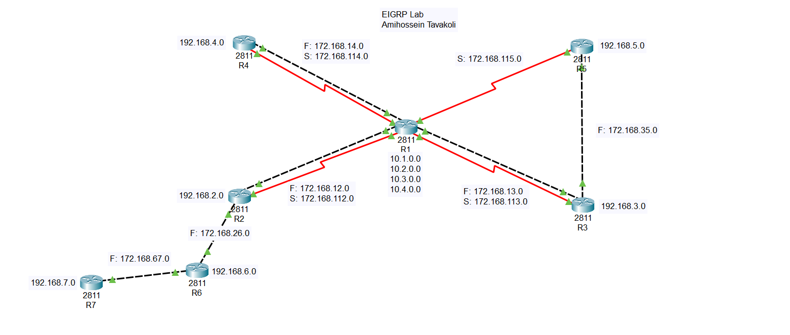

# EIGRP Dynamic Routing Lab — 7 Routers
> **Author:** Amirhossein Tavakoli  
> **Tool:** Cisco Packet Tracer  
> **Level:** Intermediate–Advanced  
---
## 📋 Overview
This lab demonstrates dynamic routing using EIGRP (Enhanced Interior Gateway Routing Protocol) across a network of 7 Cisco 2811 routers. The topology uses a mix of FastEthernet and Serial links to simulate a realistic enterprise network. EIGRP automatically discovers and propagates routing information across all routers, achieving full network convergence without manual static routes.
---
## 🖧 Topology

---
## 🎯 Objectives
- Configure EIGRP on 7 interconnected Cisco 2811 routers
- Advertise all directly connected networks via EIGRP
- Utilize both FastEthernet (F) and Serial (S) interfaces
- Verify neighbor adjacency and routing table population on all routers
- Test end-to-end connectivity across all network segments
---
## 🔧 Devices Used
| Device | Model | LAN Network | WAN Links |
|--------|-------|-------------|-----------|
| R1 | Cisco 2811 | 10.1.0.0, 10.2.0.0, 10.3.0.0, 10.4.0.0 | F: 172.168.12.0, 172.168.13.0, 172.168.14.0 / S: 172.168.112.0, 172.168.113.0, 172.168.114.0 |
| R2 | Cisco 2811 | 192.168.2.0 | F: 172.168.12.0, 172.168.26.0 / S: 172.168.112.0 |
| R3 | Cisco 2811 | 192.168.3.0 | F: 172.168.13.0 / S: 172.168.113.0 |
| R4 | Cisco 2811 | 192.168.4.0 | F: 172.168.14.0 / S: 172.168.114.0 |
| R5 | Cisco 2811 | 192.168.5.0 | F: 172.168.35.0 / S: 172.168.115.0 |
| R6 | Cisco 2811 | 192.168.6.0 | F: 172.168.26.0, 172.168.67.0 |
| R7 | Cisco 2811 | 192.168.7.0 | F: 172.168.67.0 |
---
## ⚙️ Key Configurations
### Interface IP Assignment (R1 example)
```bash
Router(config)# interface FastEthernet 0/0
Router(config-if)# ip address 172.168.12.1 255.255.255.0
Router(config-if)# no shutdown

Router(config)# interface Serial 0/0/0
Router(config-if)# ip address 172.168.112.1 255.255.255.0
Router(config-if)# clock rate 64000
Router(config-if)# no shutdown

Router(config)# interface Loopback 0
Router(config-if)# ip address 10.1.0.1 255.255.255.0
```
### EIGRP Configuration (R1 example)
```bash
Router(config)# router eigrp 100
Router(config-router)# no auto-summary
Router(config-router)# network 172.168.12.0 0.0.0.255
Router(config-router)# network 172.168.13.0 0.0.0.255
Router(config-router)# network 172.168.14.0 0.0.0.255
Router(config-router)# network 172.168.112.0 0.0.0.255
Router(config-router)# network 172.168.113.0 0.0.0.255
Router(config-router)# network 172.168.114.0 0.0.0.255
Router(config-router)# network 10.1.0.0 0.0.0.255
Router(config-router)# network 10.2.0.0 0.0.0.255
Router(config-router)# network 10.3.0.0 0.0.0.255
Router(config-router)# network 10.4.0.0 0.0.0.255
```
---
## ✅ Verification Commands
```bash
Router# show ip route
Router# show ip eigrp neighbors
Router# show ip eigrp topology
Router# show ip protocols
Router# ping 192.168.7.1
Router# traceroute 192.168.5.1
```
---
## 🌐 Network Addressing
### LAN Networks
| Network | Subnet Mask | Router |
|---------|-------------|--------|
| 192.168.2.0 | 255.255.255.0 | R2 |
| 192.168.3.0 | 255.255.255.0 | R3 |
| 192.168.4.0 | 255.255.255.0 | R4 |
| 192.168.5.0 | 255.255.255.0 | R5 |
| 192.168.6.0 | 255.255.255.0 | R6 |
| 192.168.7.0 | 255.255.255.0 | R7 |
| 10.1.0.0 | 255.255.255.0 | R1 Loopback |
| 10.2.0.0 | 255.255.255.0 | R1 Loopback |
| 10.3.0.0 | 255.255.255.0 | R1 Loopback |
| 10.4.0.0 | 255.255.255.0 | R1 Loopback |

### WAN Links (FastEthernet)
| Network | Subnet Mask | Connected Routers |
|---------|-------------|-------------------|
| 172.168.12.0 | 255.255.255.0 | R1 ↔ R2 |
| 172.168.13.0 | 255.255.255.0 | R1 ↔ R3 |
| 172.168.14.0 | 255.255.255.0 | R1 ↔ R4 |
| 172.168.26.0 | 255.255.255.0 | R2 ↔ R6 |
| 172.168.35.0 | 255.255.255.0 | R3 ↔ R5 |
| 172.168.67.0 | 255.255.255.0 | R6 ↔ R7 |

### WAN Links (Serial)
| Network | Subnet Mask | Connected Routers |
|---------|-------------|-------------------|
| 172.168.112.0 | 255.255.255.0 | R1 ↔ R2 |
| 172.168.113.0 | 255.255.255.0 | R1 ↔ R3 |
| 172.168.114.0 | 255.255.255.0 | R1 ↔ R4 |
| 172.168.115.0 | 255.255.255.0 | R1 ↔ R5 |
---
## 📁 Files
| File | Description |
|------|-------------|
| `eigrp-lab.pkt` | Cisco Packet Tracer project file |
| `topology.png` | Network topology diagram |
---
## 📚 Concepts Covered
- EIGRP neighbor adjacency and hello packets
- EIGRP metric calculation (bandwidth + delay)
- Feasible successor and successor routes
- FastEthernet vs Serial link differences
- Wildcard masks in network advertisement
- Routing table analysis with EIGRP routes
---
> 📘 Course reference: [Tosinso](https://tosinso.com) — CCNA Track
